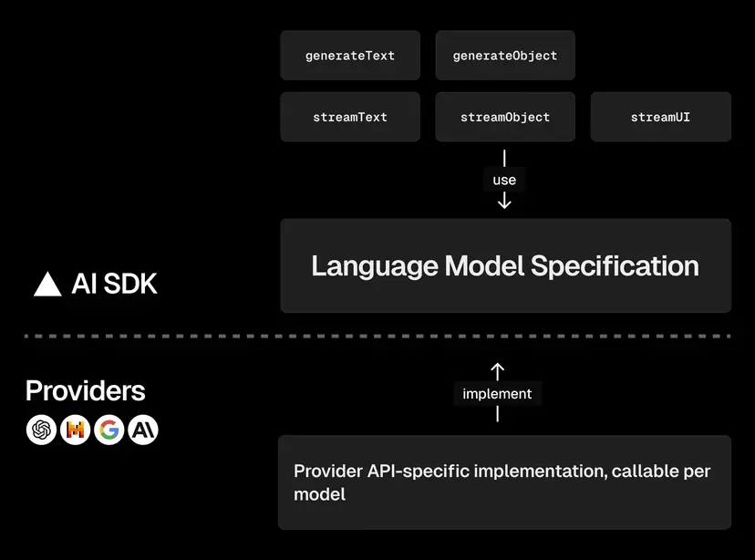
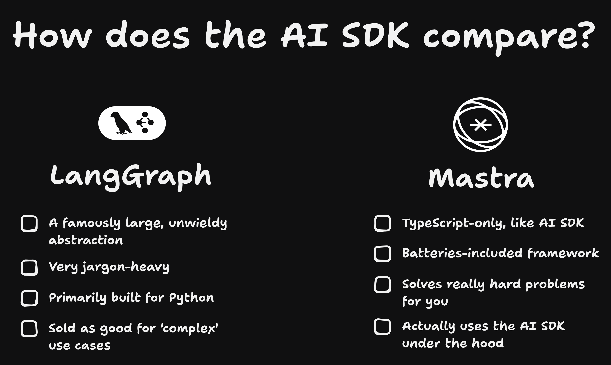

# Lab 01: Choose Your Model

## Overview

In this lab, you'll learn how to select and configure AI models with the Vercel AI SDK. You'll see how easy it is to switch between different providers (Google, Groq, Ollama) while keeping your code nearly identical.

## Learning Objectives

- Import and configure an AI provider - [Providers Documentation](https://sdk.vercel.ai/providers/ai-sdk-providers)
- Instantiate a language model
- Understand what a model object contains
- Understand provider interchangeability

## Prerequisites

Make sure you have at least one API key configured in your `.env` file:

```bash
# Choose one or more:
GOOGLE_GENERATIVE_AI_API_KEY=your_key_here
GROQ_API_KEY=your_key_here

# Or run Ollama locally (no API key needed):
# ollama pull llama3.2
```

## Your Task

Complete the TODOs in `exercise/main.ts` to:

1. Import an AI SDK provider (e.g., `@ai-sdk/google`)
2. Instantiate a model (e.g., `google('gemini-2.0-flash-lite')`)
3. Log the model to see what it contains

## Recommended Models

- Google (Requires API key) - [Documentation](https://sdk.vercel.ai/providers/ai-sdk-providers/google-generative-ai)
- Groq (Requires API key) - [Documentation](https://sdk.vercel.ai/providers/ai-sdk-providers/groq)
- Ollama (Local, no API key) - [Documentation](https://sdk.vercel.ai/providers/community-providers/ollama)

## Expected Output

When you run the exercise successfully, you should see the model configuration object:

```
{
  specificationVersion: 'v1',
  provider: 'google.generative-ai',
  modelId: 'gemini-2.0-flash-lite',
  ...
}
```

This shows you what a model object actually contains - it's just a configuration that tells the AI SDK which provider and model to use!

## Key Concepts

### How the AI SDK Works

The AI SDK provides a unified interface for working with different AI providers. Here's how it's structured:



The AI SDK uses a **Language Model Specification** that standardizes how you interact with different providers. Each provider (Google, OpenAI, Anthropic, etc.) implements this specification, which means you can switch between them with minimal code changes.

### Provider Interchangeability

The AI SDK abstracts away provider differences. Notice how you can swap providers by changing just two lines while the rest of your code stays the same!

### Why Use the AI SDK?

Compared to other frameworks, the AI SDK offers a focused, TypeScript-first approach:



The AI SDK strikes a balance between simplicity and functionality - it's not as complex as LangGraph, nor as opinionated as batteries-included frameworks like Mastra.
